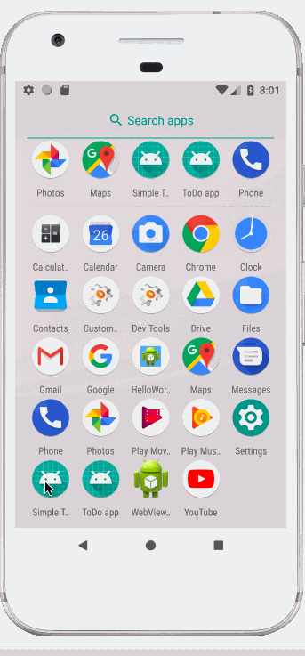
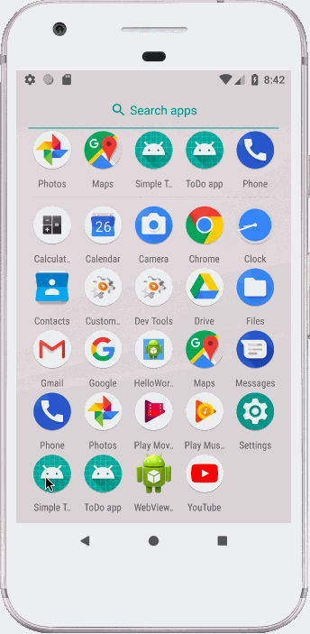

# Project 1 - Simple Todo

Simple Todo is an android app that allows building a todo list and basic todo items management functionality including adding new items, editing and deleting an existing item.

Submitted by: Constance (Connie) Ye

Time spent: 7 hours spent in total

## User Stories

The following **required** functionality is completed:

* :heavy_check_mark: User can **view a list of todo items**
* :heavy_check_mark: User can **successfully add and remove items** from the todo list
* :heavy_check_mark: User's **list of items persisted** upon modification and and retrieved properly on app restart

The following **optional** features are implemented:

* :heavy_check_mark: User can **tap a todo item in the list and bring up an edit screen for the todo item** and then have any changes to the text reflected in the todo list

The following **additional** features are implemented:

* :heavy_check_mark: **Edited app colors** for a more pleasant user experience :)
* :heavy_check_mark: App will **record & display the date that the todo note was created on**. If the user edits & saves a todo note, the daet will change to reflect the day it was edited.

## Video Walkthrough

Example of app is below.

Example of app using persistance is below.

GIF created with [LiceCap](http://www.cockos.com/licecap/).

## Notes

I learned a lot about Andriod development! At first, I had a little bit of trouble understanding exactly how the Intents and Flows were working, but I understand them now!

I also had trouble with time management and ended up submitting my assignment late, but I'll use the memory of the last minute terror I felt as motivation to work smarter next time. I wasted a bunch of time trying out pretty colors and trying to figure out how to change the font instead of working on the more important date feature.

## License

    Copyright 2018 Codepath? and Constance Ye

    Licensed under the Apache License, Version 2.0 (the "License");
    you may not use this file except in compliance with the License.
    You may obtain a copy of the License at

        http://www.apache.org/licenses/LICENSE-2.0

    Unless required by applicable law or agreed to in writing, software
    distributed under the License is distributed on an "AS IS" BASIS,
    WITHOUT WARRANTIES OR CONDITIONS OF ANY KIND, either express or implied.
    See the License for the specific language governing permissions and
    limitations under the License.
